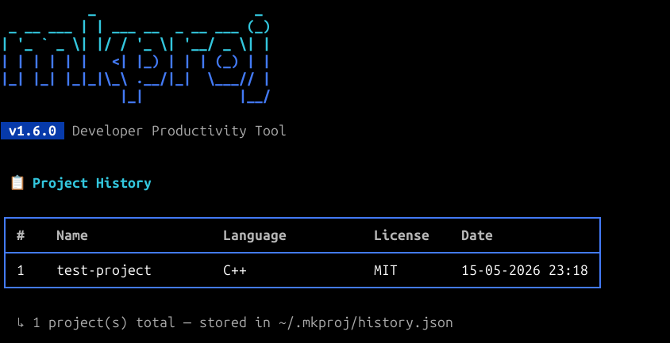

<div align="center">

<h1>mkproj</h1>

<p>A fast and flexible CLI tool to scaffold structured projects in multiple programming languages.</p>

<p>
  
  
  
  
  
</p>

</div>

---

> [!IMPORTANT]
> **mkproj v1.6.0** is now stable. This release introduces a complete UI overhaul, full project documentation, license management, and integrated Git automation.

---

## Table of Contents

- [Overview](#overview)
- [Features](#features)
- [Supported Languages](#supported-languages)
- [Installation](#installation)
- [Usage](#usage)
- [Project Structure](#project-structure)
- [Developer](#developer)
- [License](#license)

---

## Overview

**mkproj** eliminates the repetitive work of setting up new projects. Whether you are starting a microservice in Python, a system tool in C/C++, or an enterprise application in Java, mkproj generates a professional, consistent directory tree and all necessary boilerplate — in seconds.

### Preview

<p align="center">
  <em>Interactive language selection menu</em><br>
  <br><br>
  <em>Automatic directory and file generation</em><br>
  <br><br>
  <em>License addition, Git automation, and next-step guidance</em><br>
  <br><br>
  <em>List created projects</em><br>
  
</p>

---

## Features

- **Smart Scaffolding** — Generates complete directory trees, build files (CMake, Cargo, Go Mod, Maven, etc.), and starter documentation
- **Integrated Git Automation** — Initializes the repository and creates the first commit automatically
- **Multi-language Support** — Eight languages and environments out of the box
- **Refined Interactive UI** — Menus with icons, progress spinners, and clear next-step guidance
- **Modern Standards** — Follows PEP 621 for Python, Maven layout for Java, standard Go project structure, and more
- **Safety Guardrails** — Prevents accidental overwrites and validates project names before creation

---

## Supported Languages

| Language / Environment | Build System | Notes |
|---|---|---|
| Python | `pyproject.toml` (PEP 621) | Virtual env ready |
| C | CMake | Standard layout |
| C++ | CMake | Standard layout |
| Go | Go Modules | Standard project structure |
| Java | Maven | Enterprise-style layout |
| Rust | Cargo | `Cargo.toml` included |
| TypeScript | `package.json` | ESM ready |
| Web | — | HTML / CSS / JS boilerplate |

---

## Installation

### 1. Clone the repository

```bash
git clone https://github.com/avieira-dev/mkproj-cli.git
cd mkproj-cli
```

### 2. Make the entry point executable

```bash
chmod +x main.py
```

> [!TIP]
> Ensure `main.py` has the shebang line at the top: `#!/usr/bin/env python3`

### 3. Create a global symlink (Linux / macOS)

```bash
sudo ln -s "$(pwd)/main.py" /usr/local/bin/mkproj
```

Once linked, `mkproj` is available system-wide from any terminal session.

> [!NOTE]
> To uninstall, simply remove the symlink:
> ```bash
> sudo rm /usr/local/bin/mkproj
> ```

---

## Usage

```bash
mkproj new <project_name>
```

Follow the interactive menu to select a language, configure Git, and choose a license. mkproj handles the rest.

---

## Project Structure

```text
mkproj-cli/
├── commands/       
├── languages/      
├── templates/               
├── utils/          
├── main.py         
├── .gitignore
├── LICENSE
└── README.md
```

---

## Developer

**Alexandre Vieira**
GitHub: [@avieira-dev](https://github.com/avieira-dev)

---

## License

Distributed under the [MIT License](LICENSE). See `LICENSE` for details.