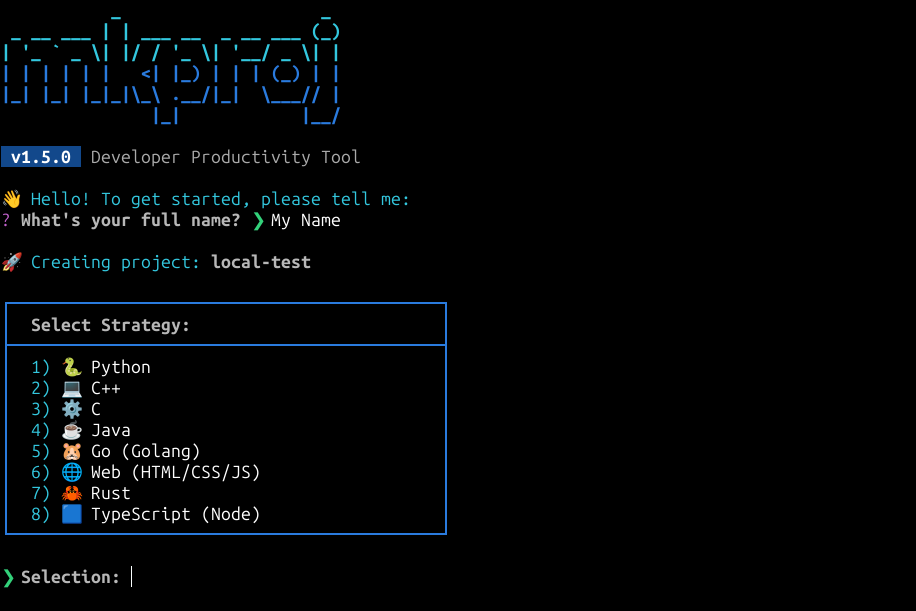
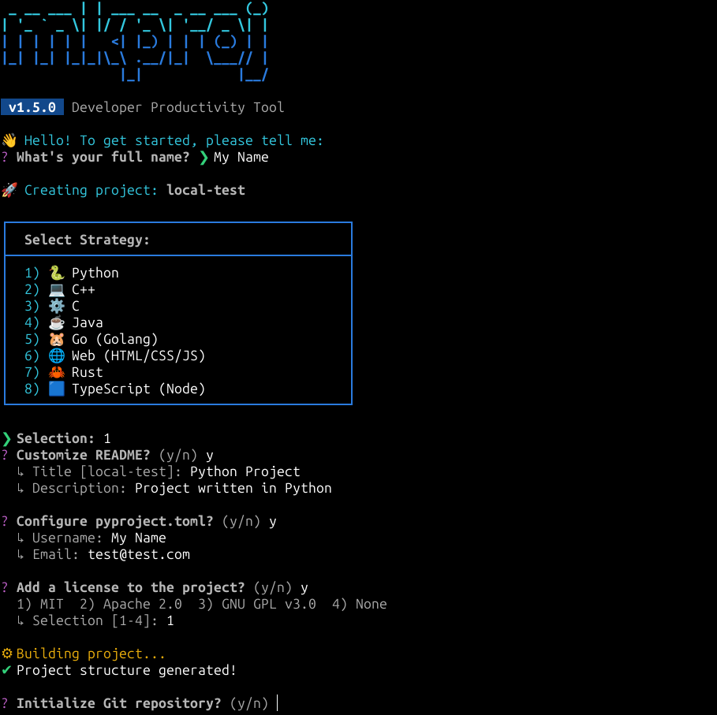
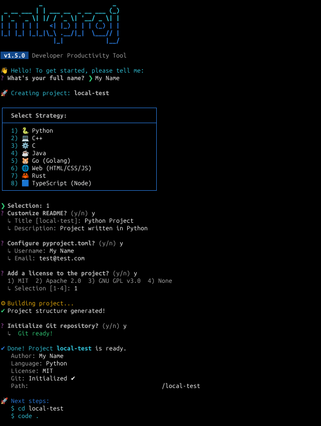

# mkproj-cli

> A fast and flexible CLI tool to scaffold structured projects in multiple programming languages.

<p align="center">
    
    
    
    
    
</p>

> [!IMPORTANT]  
> **mkproj** is now in stable version **v1.5.0**. This release introduces a complete UI overhaul, full project documentation, license addition, and integrated Git automation.

## Table of Contents

- [Overview](#overview)
- [Features](#features)
- [Installation](#installation)
- [Usage](#usage)
- [Project Structure](#project-structure)
- [Developer](#developer)
- [License](#license)

## Overview

**mkproj-cli** automates the tedious process of creating directory trees and boilerplate files. Whether you are starting a microservice in Python, a system tool in C/C++, or a corporate app in Java, **mkproj** ensures every project starts with a professional, clean, and consistent structure.

### Preview

<p align="center">
    <em>Interactive language selection menu</em><br>
    
    <br>
    <em>Automatic directory and file generation</em><br>
    
    <br>
    <em>License addition, Git automation, project summary, and next step</em><br>
    
</p>

## Features

- **Multi-language support**: Python, C, C++, Go, Java, Rust, Typescript and Web.
- **Integrated Git Automation**: Automatically initializes repositories and creates the first commit.
- **Smart Scaffolding**: Generates professional directory trees, build files (CMake, Cargo, Go Mod, etc.), and documentation.
- **Refined UI**: Interactive menus with icons, progress spinners, and clear next-step guidance.
- **Modern Standards**: Follows PEP 621 for Python, Maven-style for Java, and standard Go project layouts.
- **Safety First**: Prevents accidental overwrites and validates project names.

## Installation

### 1. Clone the Repository

```bash
git clone https://github.com/avieira-dev/mkproj-cli.git
cd mkproj-cli
```

### 2. Global Setup (Linux/MacOS)

1. Ensure `main.py` starts with the shebang: `#!/usr/bin/env python3`.
2. Make it executable and create the symbolic link:

```bash
sudo ln -s "$(pwd)/main.py" /usr/local/bin/mkproj
```

> [!TIP]  
> If you encounter permission issues, you can ensure access by running:  
> ```bash  
> chmod +x main.py  
> ```

> [!NOTE]  
> To remove the global command, run the following in the terminal:  
> ```bash  
> sudo rm /usr/local/bin/mkproj  
> ```

## Usage

Run the command and follow the interactive menu:

```bash
mkproj new <project_name>
```

## Project Structure

```text
mkproj-cli/
├── commands/
├── languages/
├── templates/
├── tests/
├── utils/
├── venv/
├── .gitignore
├── LICENSE
├── main.py
└── README.md
```

## Developer
**Alexandre Vieira**  
GitHub: [@avieira-dev](https://github.com/avieira-dev)

## License
Distributed under the license [MIT License](LICENSE). See the **LICENSE** file for more details.